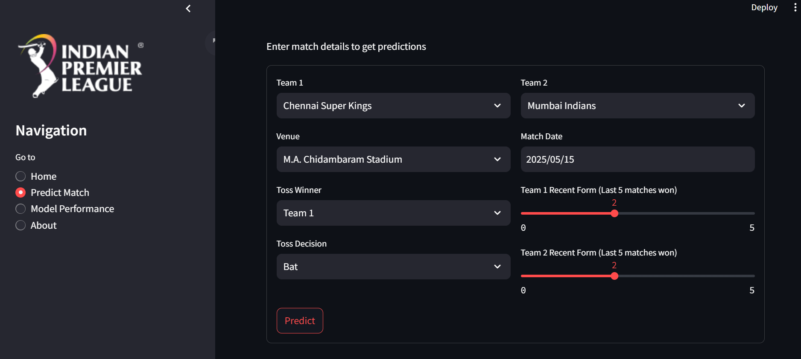
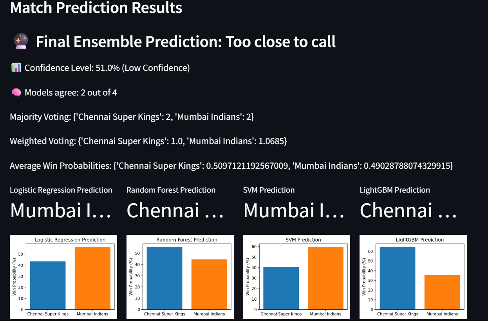
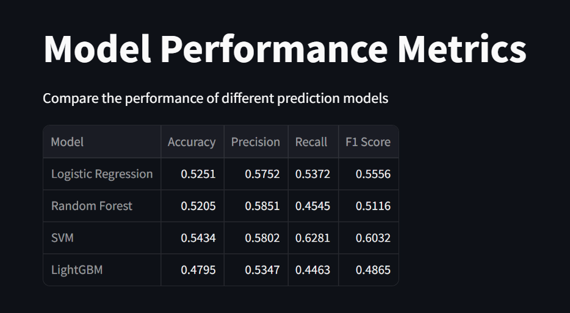
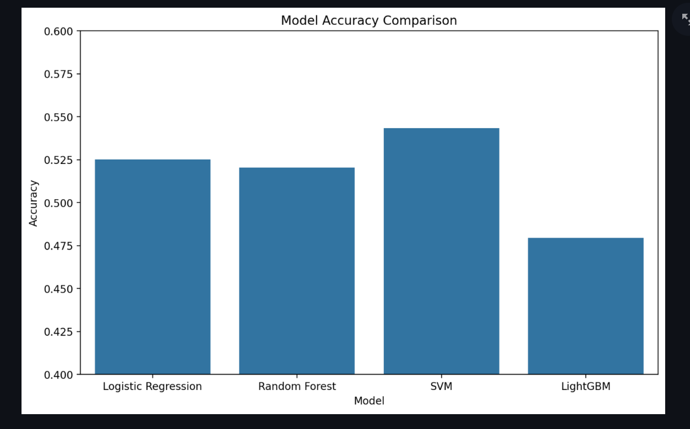

# IPL Match Prediction Application

> **⚠️ Only for learning purpose. The owner will not take any responsibility if misleaded. ⚠️**

## Project Overview
This Streamlit-based web application predicts the outcome of IPL matches using various machine learning models, including Logistic Regression, Random Forest, Support Vector Machine (SVM), and LightGBM. The app also features advanced ensemble strategies for more robust predictions.

## Features
- User-friendly interface for inputting match details
- Real-time prediction of match outcomes
- Visualization of model performance metrics
- Comparison of predictions across different models
- **Ensemble Voting Strategies:**
  - Majority Voting: Final prediction based on the most votes among models
  - Weighted Voting: Each model's vote is weighted by its historical accuracy
  - Average Win Probability: Final prediction based on the highest average win probability across models
- **Confidence Scoring:**
  - Displays a confidence level (High/Medium/Low) based on the average win probability
  - If models are not confident (probabilities close), the app reports "Too close to call"
- **Model Agreement:**
  - Shows how many models agree on the predicted winner
  - Displays detailed voting breakdown (majority, weighted, average probabilities)

## Data Sources
- IPL 2025 Match Records: Contains detailed information for each match played in the 2025 season
- Ball-by-Ball Data: Provides granular details of each delivery in the matches
- Historical Data (2008-2024): Offers a comprehensive view of past seasons to enhance model training

## Machine Learning Models
- **Logistic Regression**: A baseline model for binary classification tasks
- **Random Forest Classifier**: An ensemble method that builds multiple decision trees for more accurate predictions
- **Support Vector Machine (SVM)**: Effective in high-dimensional spaces and suitable for classification tasks
- **LightGBM**: A gradient boosting framework that uses tree-based learning algorithms, known for its speed and efficiency

## Implementation Steps
1. **Data Preprocessing**:
   - Clean and merge datasets
   - Handle missing values
   - Encode categorical variables
   - Feature engineering to create relevant predictors

2. **Model Training**:
   - Split data into training and testing sets
   - Train each model using the training data
   - Evaluate performance using metrics like accuracy, precision, recall, and F1-score
   - Save trained models for later use

3. **Ensemble & Prediction Logic**:
   - Collect predictions and probabilities from all models
   - Apply majority voting, weighted voting, and average probability strategies
   - Calculate and display confidence score and model agreement
   - Handle low-confidence scenarios ("Too close to call")

4. **Streamlit Application**:
   - Develop an interactive UI for users to input match details
   - Display predictions from each model and ensemble
   - Visualize model performance metrics and agreement

## Project Structure
```
├── data/
│   ├── raw/            # Raw data files
│   └── processed/      # Processed data ready for modeling
├── models/             # Trained model files
├── notebooks/          # Jupyter notebooks for exploration
├── src/
│   ├── data/           # Scripts for data processing
│   ├── features/       # Scripts for feature engineering
│   ├── models/         # Scripts for model training and evaluation
│   └── visualization/  # Scripts for data visualization
├── app.py              # Main Streamlit application
├── requirements.txt    # Project dependencies
└── README.md           # Project documentation
```

## Screenshots
Here are some screenshots of the application interface:






## Setup and Installation
1. Clone the repository
2. Install dependencies: `pip install -r requirements.txt`
3. Run the application: `streamlit run app.py`

## Usage
Enter the required match details in the input form and click on the "Predict" button to see the predicted outcome from different models and the ensemble strategy.
